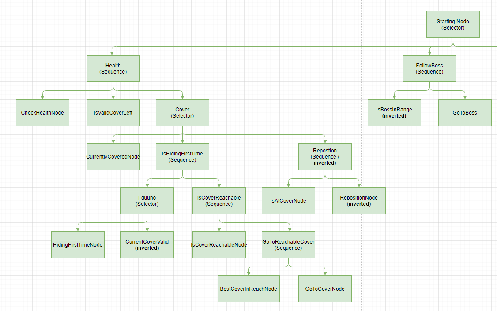
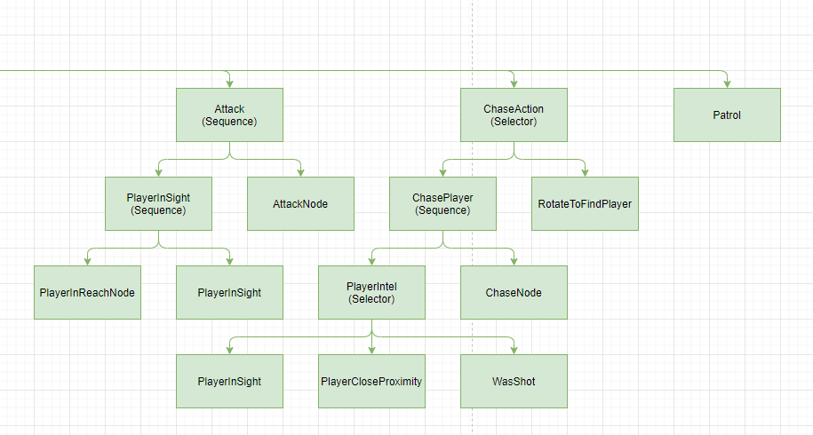

# PersonalPortfolio

    <h1>An implementation of AI using behaviour trees with dynamic mesh deformation.</h1>
    <h2> Description of the current functionality</h2>
    

        The agents start off by patrolling with their "boss", infiltrating the environment, looking for potential danger. Attention can be caused in multiple ways: see the player, hear the player, or being shot at.
        Once they saw the player they start to actively hunt and shoot the player, but retreat when the "boss" is too far away.
        Should the agents lose the player, they'll walk to the last known position and look around, trying to find the player again.
        If health should be low, the agents take cover behind the first object, that fully covers it and get into position at the best possible angle to the player. The agents then actively walk around the object trying to maintain the best position, to stay out of sight to heal. If an obstacle should, e.g. fall over, the agents notice this and try to cover up somewhere else. Being at full health again, the agents look around, ensuring that there is no danger to then reunite.
    

    <h2>Current state of the behavior tree</h2>

